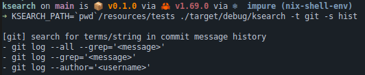
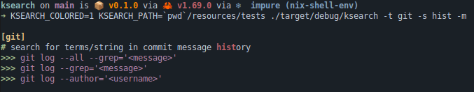

# ksearch

Ksearch stands for `knowledge search`. I am using different kind of place to store knowledge (zettelkasten, Firefox bookmarks, Gist...). The issue is that I tend to forget where I've stored all of this... 

To solve this memory issue, I use this tool to index where I store my stuff.  
However, it's a manual indexing process (where you have to write your TOML file) which is kind of slow.  

Knowledges are defined using TOML files parsed by this tool.

## Usage

```
CLI to search knowlege from JSON files

Usage: ksearch [OPTIONS]

Options:
  -s, --search <search>  Term to search [default: ]
  -t, --topic <topic>    Targeted search topic [default: ]
  -f, --filter <filter>  Search filters such as tags [default: ]
  -e, --environment      Show environment variable
  -p, --path             Show topic path if exist
  -i, --inventory        List all available topics
  -m, --match-color      Enable colored match
  -l, --list             List all CUE files with fullpath
  -h, --help             Print help
```

## Environment variables

- `KSEARCH_PATH` paths for where to find JSON files
- `KSEARCH_COLORED` if defined (whatever the value) it will activate colored output

## Example

```
$ ksearch -s <term> -t <topic> -f <tags>
$ ksearch -s <term> -m
$ ksearch -s <term> -t <topic> -m
$ ksearch -t <topic> -p
$ ksearch -e
$ ksearch -i
$ ksearch --generate
$ ksearch -l
```





## Create a resources directory

```
$ pwd
/home/user/dev/git/ksearch_resources/

# Create directories
$ mkdir -p resources/
$ cd resources/

$ cat > auditd.toml <<EOF
[[knowledges]]
description = "rotate auditd logs"
data = [
  "/etc/init.d/auditd rotate",
  "kill -USR1 $(pidof auditd)"
]
tags = []

[[knowledges]]
description = "florian roth overview and resources"
data = [
  "https://github.com/Neo23x0/auditd"
]
tags = ["link"]
EOF

# Tests: Generate JSON file from CUE
$ KSEARCH_PATH=`pwd`/resources/ ksearch -G
$ ls `pwd`/resources/json/
pfsense.json
```

## BONUS

### FZF integration

It's possible to use fzf to have so kind of searchable frontend to edit or view CUE files

```
$ KSEARCH_PATH=`pwd`/resources/tests ./target/debug/ksearch -l | fzf -e --preview 'bat -l go --style changes,header --color=always --line-range :500 {}' --bind 'ctrl-e:become($EDITOR {+})'  --bind 'enter:become(bat -l go --style changes,header --color=always {})'
```

### Nix derivation


```
{ lib, fetchFromGitHub, rustPlatform, pkg-config, git, openssl, installShellFiles }:

rustPlatform.buildRustPackage rec {
  pname = "ksearch";
  version = "1.0.3";

  src = fetchFromGitHub {
    owner = "bib0x";
    repo = pname;
    rev = "v${version}";
    sha256 = "sha256-UD1GhyEstOQBo8S1V6vvWAwh+IpbmcSxLzf6CAj92kw=";
  };

  cargoHash = "sha256-2NtO83RvMDVw4nwaYQyDaqJxB/2OrLt56yXZIUDsC5M=";

  nativeBuildInputs = [ git pkg-config installShellFiles ];
  buildInputs = [ openssl ];

  postInstall = ''
    git apply patches/bash_completions.bash
    installShellCompletion --bash --name ksearch completions/ksearch.bash
  '';

  meta = with lib; {
    description = "JSON based knowledge search";
    homepage = "https://github.com/bib0x/ksearch";
    license = licenses.unlicense;
    maintainers = with maintainers; [ "bib0x" ];
  };
}
```
